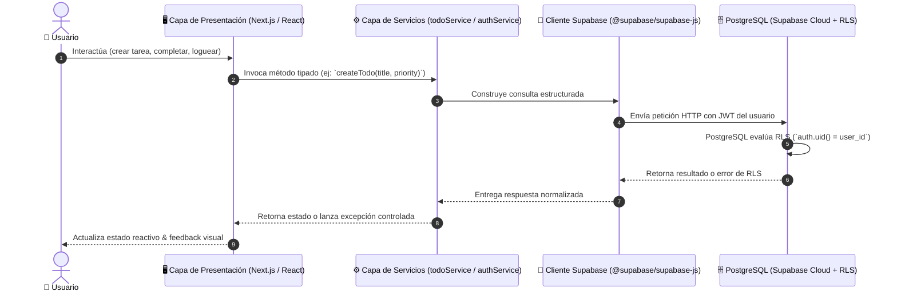

# 🏛️ Documentación de Arquitectura - To-Do List con Supabase & Next.js

Esta aplicación sigue una **Arquitectura en Capas (Layered Architecture)** limpia y desacoplada, orientada al desarrollo profesional con frameworks modernos y Backend-as-a-Service (BaaS).

---

## 📌 Principios de Diseño
1. **Separación de Responsabilidades (SoC)**: La interfaz gráfica (UI) no contiene lógica directa de SQL ni de cliente HTTP de Supabase; consume capas de servicio dedicadas.
2. **Seguridad en la Base de Datos (Defense in Depth)**: La seguridad de los datos no depende solo del cliente; Supabase aplica **Row Level Security (RLS)** a nivel de base de datos en PostgreSQL.
3. **Tipado Estricto de Datos**: TypeScript modela todas las entidades y respuestas de Supabase para evitar errores en tiempo de ejecución.
4. **Diseño Visual de Alta Fidelidad**: Sistema de diseño basado en variables CSS nativas, glassmorphism, modo oscuro por defecto y micro-animaciones fluidas.

---

## 🗺️ Diagrama de Flujo de Datos



---

## 📂 Organización de Carpetas y Capas

```text
src/
├── app/                     # 🌐 Capa de Rutas y Páginas (App Router)
│   ├── layout.tsx           # Layout global, fuentes y contenedores
│   ├── page.tsx             # Redirección inteligente
│   ├── login/page.tsx       # Módulo de Autenticación (Login & Registro)
│   └── dashboard/page.tsx   # Panel principal del gestor de tareas
│
├── components/              # 🎨 Capa de Presentación (UI Components)
│   ├── auth/                # Formularios y tarjetas de autenticación
│   ├── todos/               # Listas, elementos de tareas, barra de filtros, estadísticas
│   └── ui/                  # Componentes reutilizables (Botones, Inputs, Badges, Modales)
│
├── services/                # ⚙️ Capa de Lógica de Negocio y Servicios
│   ├── authService.ts       # Operaciones de sesión (login, registro, logout, usuario actual)
│   └── todoService.ts       # Operaciones CRUD sobre tareas (get, add, toggle, delete, update)
│
├── lib/                     # 🔌 Capa de Infraestructura / Integración
│   └── supabase/
│       ├── client.ts        # Cliente Supabase singleton para Browser
│       └── server.ts        # Utilidad para Server Components / Actions
│
├── types/                   # 🏷️ Capa de Modelos y Tipos
│   ├── todo.ts              # Interfaces de Tareas, Prioridades, Filtros
│   └── database.types.ts    # Tipos generados/definidos del esquema PostgreSQL
│
└── styles/                  # 🎨 Sistema de Diseño
    └── globals.css          # Variables CSS, diseño glassmorphic y utilidades
```

---

## 🔒 Modelo de Seguridad: Row Level Security (RLS)

A diferencia de las arquitecturas tradicionales donde un backend monolítico valida permisos:
- Cada consulta hacia Supabase viaja con el **JSON Web Token (JWT)** del usuario autenticado.
- PostgreSQL evalúa automáticamente `auth.uid() = user_id` antes de leer, escribir o eliminar cualquier fila en la tabla `todos`.
- Si un usuario malicioso intentara solicitar o modificar el ID de una tarea ajena, PostgreSQL rechaza la operación a nivel de motor de base de datos con `403 Forbidden` / retorno vacío.
